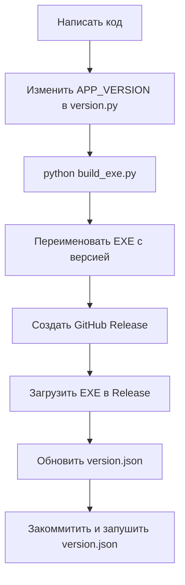
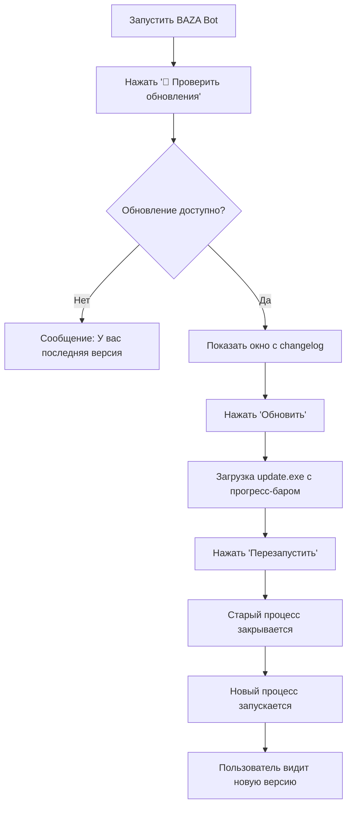

# 🔄 Система обновлений BAZA Trading Bot

## 📖 Содержание

1. [Как работает система обновлений](#как-работает-система-обновлений)
2. [Почему нельзя обновлять текущий EXE](#почему-нельзя-обновлять-текущий-exe)
3. [Как выпустить новую версию](#как-выпустить-новую-версию)
4. [Структура проекта](#структура-проекта)
5. [Частые ошибки и решения](#частые-ошибки-и-решения)
6. [Workflow обновления](#workflow-обновления)

---

## 🎯 Как работает система обновлений

### Общая схема

```
┌─────────────┐       ┌───────────────┐       ┌──────────────┐
│  Пользователь│       │   GitHub      │       │  Приложение  │
│  (BAZA Bot)  │────>│  Releases     │<────│  (updater/)  │
└─────────────┘  1    └───────────────┘   2   └──────────────┘
      │                     │                        │
      │ 3. Нажимает        │ version.json           │
      │ "Проверить         │ + EXE файл             │
      │  обновления"       │                        │
      ▼                     ▼                        ▼
┌─────────────────────────────────────────────────────────┐
│  4. Скачивается BAZA_TradingBot_update.exe              │
│  5. Пользователь нажимает "Перезапустить"              │
│  6. Старый процесс закрывается                          │
│  7. Запускается новый EXE (update.exe)                  │
└─────────────────────────────────────────────────────────┘
```

### Пошаговый процесс

1. **Проверка версии**
   - Пользователь нажимает кнопку `🔄 Проверить обновления`
   - Приложение скачивает `version.json` с GitHub
   - Сравнивается `APP_VERSION` (текущая) с `latest_version` (новая)

2. **Показ информации об обновлении**
   - Если версия новее - открывается окно с информацией:
     - Текущая версия
     - Новая версия
     - Список изменений (changelog)
     - Размер файла

3. **Загрузка обновления**
   - Пользователь нажимает кнопку `Обновить`
   - Скачивается новый EXE с именем `BAZA_TradingBot_update.exe`
   - Отображается прогресс-бар с процентами
   - UI не блокируется (загрузка в отдельном потоке)

4. **Применение обновления**
   - После завершения загрузки показывается кнопка `Перезапустить`
   - При нажатии:
     - Запускается `BAZA_TradingBot_update.exe`
     - Текущий процесс корректно завершается
     - Пользователь видит обновленную версию

---

## 🚫 Почему нельзя обновлять текущий EXE

### Техническая причина

Windows блокирует запущенные исполняемые файлы от записи. Если попытаться перезаписать `BAZA_TradingBot.exe` пока он запущен:

```
PermissionError: [WinError 32] 
Процесс не может получить доступ к файлу, так как этот файл используется другим процессом
```

### Решение

**Загружаем обновление с другим именем** → **Запускаем новый EXE** → **Закрываем старый**

### Альтернативные подходы (не используются)

| Подход | Проблемы |
|--------|----------|
| Перезапись после закрытия | Требует внешний батник/скрипт, сложно |
| Временный launcher | Усложняет архитектуру, лишний файл |
| Self-extracting archive | Антивирусы блокируют, пугает пользователей |

---

## 📦 Как выпустить новую версию

### Шаг 1: Обновить версию в коде

Отредактируйте файл `version.py`:

```python
# version.py

APP_VERSION = "1.1.0"  # Была 1.0.0

VERSION_CHECK_URL = "https://raw.githubusercontent.com/USERNAME/REPO/main/version.json"

VERSION_NOTES = {
    "1.1.0": [
        "Добавлена система автоматических обновлений",
        "Исправлена ошибка с AI Scheduler",
        "Оптимизирована скорость анализа"
    ]
}
```

### Шаг 2: Собрать новый EXE

```bash
# Активировать venv
.\.venv\Scripts\Activate.ps1

# Собрать EXE
python build_exe.py

# Результат: dist/BAZA_TradingBot.exe (~218 MB)
```

### Шаг 3: Переименовать EXE для релиза

```powershell
# Переименовать для ясности версии
Copy-Item "dist/BAZA_TradingBot.exe" "BAZA_TradingBot_v1.1.0.exe"
```

### Шаг 4: Создать GitHub Release

1. Откройте репозиторий на GitHub
2. Перейдите в `Releases` → `Draft a new release`
3. Заполните форму:
   - **Tag version**: `v1.1.0`
   - **Release title**: `BAZA Trading Bot v1.1.0`
   - **Description**: Скопируйте из `VERSION_NOTES`
   - **Attach binaries**: Загрузите `BAZA_TradingBot_v1.1.0.exe`
4. Нажмите `Publish release`

### Шаг 5: Обновить version.json

Создайте/обновите файл `version.json` в **корне репозитория**:

```json
{
  "latest_version": "1.1.0",
  "download_url": "https://github.com/USERNAME/REPO/releases/download/v1.1.0/BAZA_TradingBot_v1.1.0.exe",
  "size_mb": 218,
  "changelog": [
    "Добавлена система автоматических обновлений",
    "Исправлена ошибка с AI Scheduler",
    "Оптимизирована скорость анализа"
  ]
}
```

**⚠️ ВАЖНО**: URL должен быть прямой ссылкой на файл из GitHub Releases!

### Шаг 6: Закоммитьте и запушьте version.json

```bash
git add version.json
git commit -m "Release v1.1.0"
git push origin main
```

### Шаг 7: Проверка

1. Откройте `https://raw.githubusercontent.com/USERNAME/REPO/main/version.json` в браузере
2. Убедитесь что видите актуальный JSON
3. Запустите старую версию бота и нажмите `🔄 Проверить обновления`

---

## 📁 Структура проекта

```
BAZA/
├── version.py                    # Версия приложения (APP_VERSION)
├── updater/                      # Модуль обновлений
│   ├── __init__.py              # Экспорты
│   ├── update_checker.py        # Проверка версий
│   ├── downloader.py            # Загрузка файлов
│   └── ui_update_window.py      # GUI окно обновления
├── src/
│   └── gui/
│       └── app.py               # Интеграция кнопки обновления
├── dist/
│   ├── BAZA_TradingBot.exe      # Основной EXE
│   └── BAZA_TradingBot_update.exe  # Обновленная версия (после загрузки)
└── version.json                 # Загружается на GitHub (не в проекте)
```

### Описание модулей

#### `version.py`
Централизованное хранение версии. **Единственное место где нужно менять версию.**

#### `updater/update_checker.py`
- Класс `UpdateChecker`
- Скачивает `version.json` с GitHub
- Сравнивает версии используя библиотеку `packaging`
- Возвращает информацию об обновлении или `None`

#### `updater/downloader.py`
- Класс `UpdateDownloader`
- Скачивает EXE файл по частям (chunks)
- Callback для обновления прогресс-бара
- Поддержка отмены загрузки
- Автоматическое удаление при ошибке

#### `updater/ui_update_window.py`
- Класс `UpdateWindow` (Tkinter Toplevel)
- Модальное окно с информацией об обновлении
- Прогресс-бар для визуализации загрузки
- Кнопка перезапуска после успешной загрузки

#### `src/gui/app.py` (интеграция)
- Кнопка `🔄 Проверить обновления` в левой панели
- Метод `check_for_updates()` - запускает проверку в отдельном потоке
- Метод `_show_update_window()` - отображает окно обновления

---

## ⚠️ Частые ошибки и решения

### 1. Ошибка: "Failed to check for updates (network error)"

**Причина**: Нет доступа к GitHub или неверный URL

**Решение**:
- Проверьте интернет-соединение
- Убедитесь что `VERSION_CHECK_URL` в `version.py` правильный
- Откройте URL в браузере и проверьте что файл доступен

---

### 2. Ошибка: "EXE не заменяется" или "Permission denied"

**Причина**: Windows блокирует запущенный файл

**Решение**:
- ✅ **Правильно**: Загружаем `BAZA_TradingBot_update.exe` (другое имя)
- ❌ **Неправильно**: Пытаемся перезаписать текущий `BAZA_TradingBot.exe`

Наша система **уже реализована правильно**, эта ошибка не должна возникать.

---

### 3. Ошибка: Антивирус блокирует загрузку

**Причина**: Windows Defender или антивирус считает EXE подозрительным

**Решение**:
- Добавьте репозиторий GitHub в исключения антивируса
- Подпишите EXE цифровой подписью (для коммерческих версий)
- Загружайте с HTTPS (наша система использует GitHub - всегда HTTPS)

**Временное решение для пользователей**:
1. Откройте Windows Defender
2. Настройки → Защита от вирусов → Управление параметрами
3. Исключения → Добавить → Папка → Выберите папку с BAZA Bot

---

### 4. Ошибка: version.json содержит неверный URL

**Причина**: URL не указывает на файл напрямую

**Пример неправильного URL**:
```
https://github.com/user/repo/releases   ❌ (страница релизов)
```

**Пример правильного URL**:
```
https://github.com/user/repo/releases/download/v1.1.0/BAZA_TradingBot_v1.1.0.exe  ✅
```

**Решение**: Скопируйте прямую ссылку на файл из GitHub Releases:
1. Откройте релиз
2. ПКМ на файле EXE → Копировать адрес ссылки
3. Вставьте в `version.json`

---

### 5. Ошибка: Обновление загружается но не запускается

**Причина**: Файл не скачался полностью или поврежден

**Решение**:
- Проверьте размер файла `BAZA_TradingBot_update.exe`
- Сравните с `size_mb` из `version.json`
- При ошибке удалите файл и повторите загрузку

---

### 6. Ошибка: Кнопка обновления не работает

**Причина**: Отсутствует зависимость `packaging`

**Решение**:
```bash
pip install packaging
```

Добавьте в `requirements.txt`:
```
packaging>=23.0
```

---

## 🔄 Workflow обновления (от кода до пользователя)

### Для разработчика



### Для пользователя



---

## 🎨 Скриншоты

### 1. Кнопка в интерфейсе

```
╔════════════════════════════╗
║  ⚙ Settings               ║
║  🔗 MT5 Settings           ║
║  🔄 Проверить обновления  ║  ← Новая кнопка
╚════════════════════════════╝
```

### 2. Окно обновления

```
┌────────────────────────────────────┐
│  🎉 Доступно обновление!           │
├────────────────────────────────────┤
│  Текущая версия: 1.0.0             │
│  Новая версия: 1.1.0               │
│  Размер файла: 218 MB              │
├────────────────────────────────────┤
│  Что нового:                        │
│  • Система автоматических обновлений│
│  • Исправлена ошибка AI Scheduler  │
│  • Оптимизирована скорость         │
├────────────────────────────────────┤
│         [Отмена]  [Обновить]       │
└────────────────────────────────────┘
```

### 3. Процесс загрузки

```
┌────────────────────────────────────┐
│  Загрузка обновления...            │
│  ████████████████░░░░░░░░  75.3%  │
│  Загружено 164.1 MB из 218 MB      │
└────────────────────────────────────┘
```

---

## 🔒 Безопасность

### Рекомендации

1. **HTTPS Only**: Всегда используйте HTTPS для `version.json` и EXE
2. **Проверка размера**: `size_mb` помогает обнаружить поврежденные загрузки
3. **GitHub Releases**: Официальный механизм распространения
4. **Логирование**: Все действия записываются в логи

### Что НЕ делать

❌ Использовать HTTP (незащищенное соединение)  
❌ Хранить EXE на сторонних файлообменниках  
❌ Загружать обновления из непроверенных источников  
❌ Отключать проверку версий  

---

## 📚 Дополнительная информация

### Зависимости

```txt
packaging>=23.0  # Для сравнения версий
```

### Переменные окружения

Не требуются. Все настройки в `version.py`.

### Тестирование

```python
# Создайте тестовый version.json локально
python -m http.server 8000

# В version.py укажите:
VERSION_CHECK_URL = "http://localhost:8000/version.json"

# Протестируйте обновление
```

---

## 💡 Будущие улучшения

### Возможные дополнения

- [ ] Автоматическая проверка обновлений при запуске
- [ ] Уведомления в Telegram о новых версиях
- [ ] Откат к предыдущей версии
- [ ] Delta-обновления (только измененные файлы)
- [ ] Цифровая подпись EXE
- [ ] Автоматическое удаление старых версий

---

## 🆘 Поддержка

При возникновении проблем:

1. Проверьте логи: `logs/baza_YYYYMMDD.log`
2. Найдите строки с `[UPDATE]`
3. Создайте Issue в GitHub с логами и описанием проблемы

---

## 📝 Changelog системы обновлений

### v1.0.0 (2026-01-13)
- ✅ Проверка версий с GitHub
- ✅ Модальное окно с changelog
- ✅ Загрузка с прогресс-баром
- ✅ Автоматический перезапуск
- ✅ Интеграция в GUI
- ✅ Подробная документация

---

**Автор**: BAZA Development Team  
**Лицензия**: MIT  
**Версия документации**: 1.0.0
